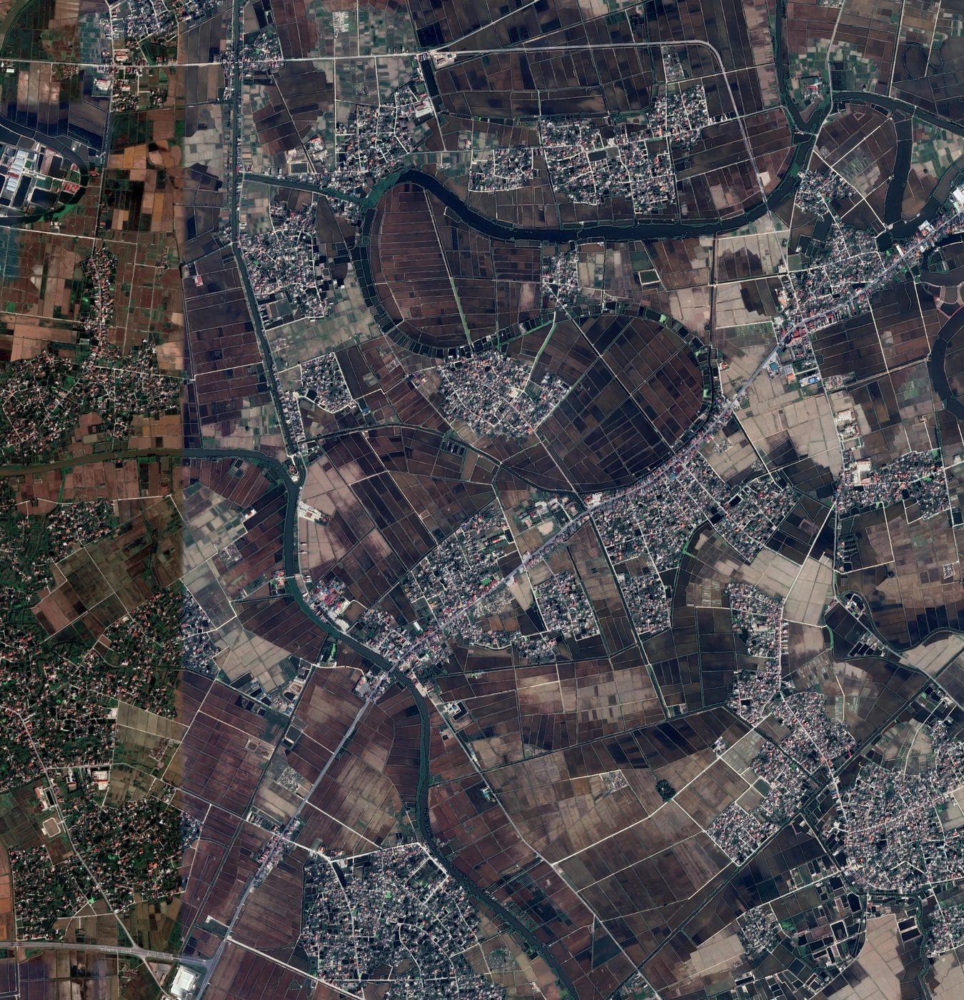
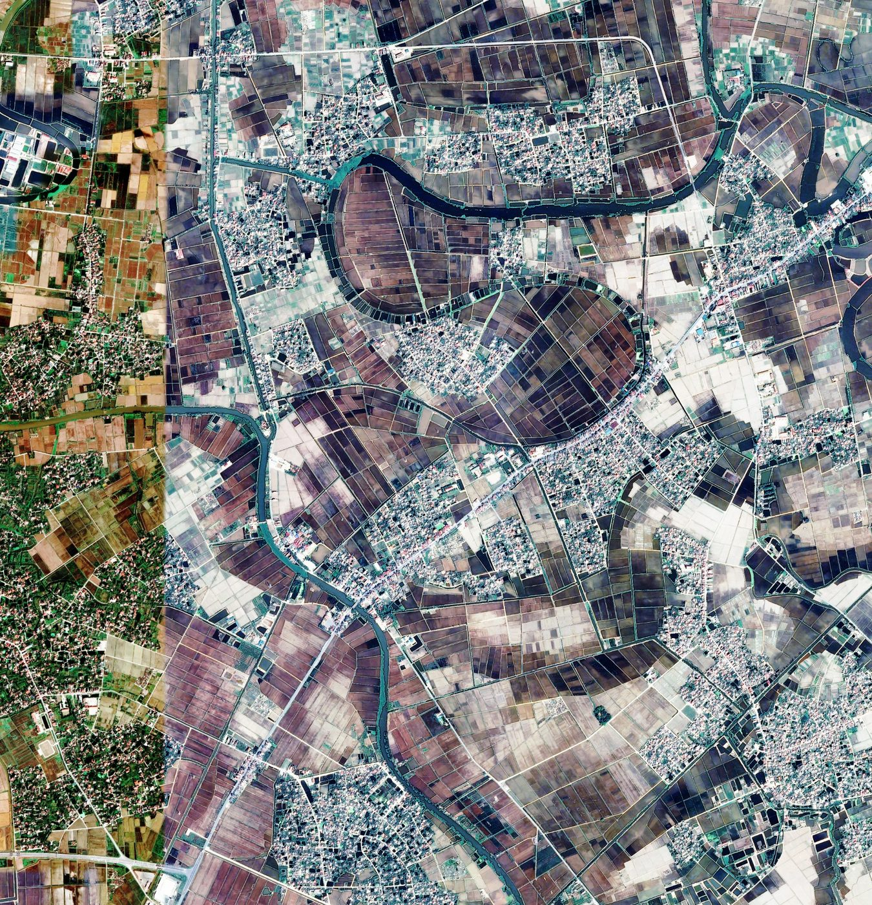
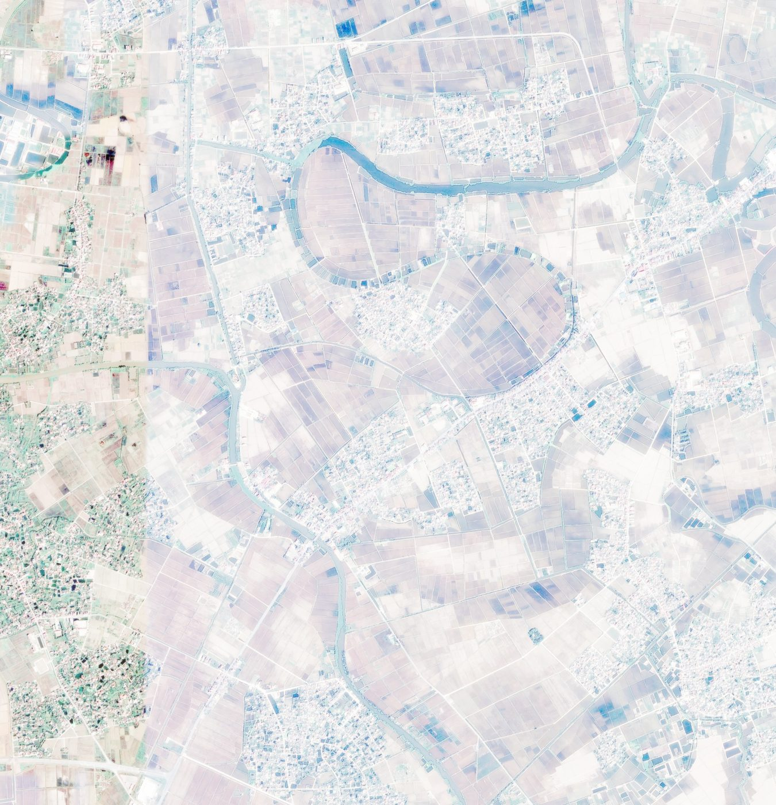
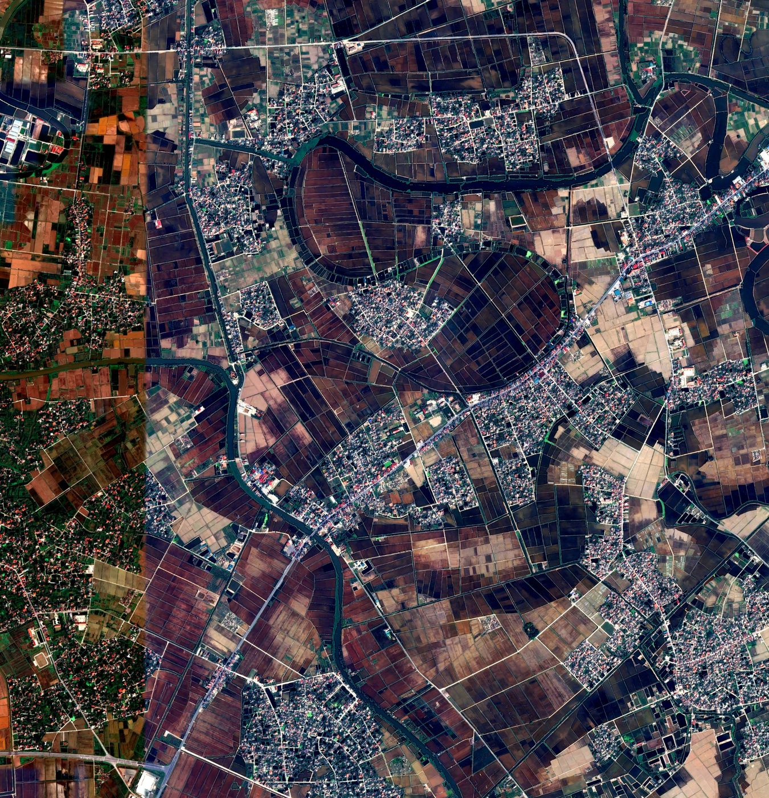

# 🛰️ tif2jpg_pipeline：GeoTIFF 裁剪 + 转 JPG + 多种增强（可选）✨

> 目标：把 **1 波段 / 3 波段** 的 GeoTIFF（`.tif/.tiff`）批处理为 **可直接训练/可视化** 的 JPG，并支持 **裁剪 patch** 与 **多种增强策略**（AutoLevel / Equalize / MSR / PIL）。

---

## ✅ 功能一览

- ✂️ **裁剪（Crop）**  
  支持 1 波段与 3 波段 tif，按 `crop_size/stride` 生成 patch，输出到 **folder1**  
  - 默认输出 **tif patch**（保留地理参考）
  - 可选输出 **jpg patch**（更适合训练集）

- 🖼️ **tif → jpg（Convert）**  
  批量把 tif 转换为 JPG，输出到 **folder2**  
  - `raw/`：仅进行位深映射与分位拉伸（推荐）
  - `enhanced_xxx/`：在 raw 基础上做增强（按超参数选择）

- 🎛️ **增强策略可选（Enhance）**  
  支持根据超参数切换不同增强方法：
  - `none` / `autolevel` / `equalize` / `msr` / `pil`

---

## 🧠 增强到底放在 tif 还是 jpg？

遥感 tif 常见是 **16-bit / float**，而 JPG 是 **8-bit**。  
因此建议采用下面的分阶段策略：

1. ✅ **先在 tif 的高位深上做动态范围映射**（例如分位拉伸/AutoLevel 的思想）  
2. ✅ **再转成 8-bit（raw jpg）**  
3. ✅ **在 raw jpg 上做 OpenCV/PIL 风格增强**（equalize / msr / pil 等）

本项目默认就是这样做的：  
- `--pre_uint8_stretch 1`（默认开启）会先做分位拉伸再量化到 8-bit  
- `equalize/msr/pil` 在 **raw 8-bit** 上执行，稳定可控

---

## 🖼️ 效果示例（压缩展示版）

> 说明：原图过大，这里展示的是 **等比例压缩后的对比图**，便于在 GitHub 页面浏览。

### 1) 原图（raw / baseline）


### 2) AutoLevel（分位拉伸/对比度拉伸）


### 3) Equalize（白平衡 + 三通道均衡）


### 4) MSR（Multi-Scale Retinex）


### 5) PIL（对比度 + 色彩增强）


---

## 📦 输出目录结构（默认）

默认输出目录与 `input_dir` **同级**（即 `input_dir` 的父目录下）：

- `crop_out_dir/`：裁剪输出（默认 tif patch）
- `crop_as_jpg/`：当 `--crop_as_jpg 1` 时，裁剪输出的 jpg patch
- `jpg_out_dir/`
  - `raw/xxx.jpg`
  - `enhanced_<method>/xxx_<method>.jpg`

---

## 🏷️ 命名规则（裁剪 patch）

裁剪后的 patch 命名规则：  
✅ **原始名称 + `_` + 序号**，序号从 `0` 开始递增（每个原始 tif 单独从 0 计数）

例如 `ABC.tif` →  
- `ABC_0.tif, ABC_1.tif, ...` 或  
- `ABC_0.jpg, ABC_1.jpg, ...`（当 `--crop_as_jpg 1`）

---

## 🚀 快速开始

### 1) 安装依赖

- Python 3.8+
- GDAL（需要能 `from osgeo import gdal`）
- numpy
- opencv-python
- pillow（仅 `--enhance pil` 时需要）
- tqdm（可选）

### 2) 一键运行（不传输出路径也行）

```bash
python tif2jpg_pipeline_v3.py --input_dir "D:\data\tif" --do_crop 1 --do_convert 1
```

---

## ✂️ 裁剪（Crop）用法

### 输出 tif patch（保留地理参考）
```bash
python tif2jpg_pipeline_v3.py ^
  --input_dir "D:\data\tif" ^
  --do_crop 1 --do_convert 0 ^
  --crop_size 256 --stride 256 ^
  --skip_zero 1
```

### 输出 jpg patch（训练更方便）
```bash
python tif2jpg_pipeline_v3.py ^
  --input_dir "D:\data\tif" ^
  --do_crop 1 --do_convert 0 ^
  --crop_as_jpg 1 ^
  --crop_size 256 --stride 256
```

---

## 🖼️ 转换（Convert）+ 增强（Enhance）用法

### raw + MSR
```bash
python tif2jpg_pipeline_v3.py ^
  --input_dir "D:\data\tif" ^
  --do_crop 0 --do_convert 1 ^
  --enhance msr --msr_scales 15,101,301 ^
  --jpg_quality 95
```

### raw + Equalize（可选白平衡）
```bash
python tif2jpg_pipeline_v3.py ^
  --input_dir "D:\data\tif" ^
  --do_crop 0 --do_convert 1 ^
  --enhance equalize --do_white_balance 1
```

### raw + PIL（对比度/色彩）
```bash
python tif2jpg_pipeline_v3.py ^
  --input_dir "D:\data\tif" ^
  --do_crop 0 --do_convert 1 ^
  --enhance pil --pil_contrast 1.5 --pil_color 1.5
```

---

## 🎚️ 常用参数速查

- `--crop_size`：patch 尺寸（默认 256）
- `--stride`：滑窗步长（默认 256）
- `--skip_zero`：patch 内含 0 像素就跳过（默认 1）
- `--band_order`：三波段读取顺序（默认 `1,2,3`）
- `--stretch_low / --stretch_high`：分位拉伸强度（默认 `0.001~0.999`）
  - 想更“猛”可以试：`0.01~0.99`
- `--enhance`：增强方法（`none/autolevel/equalize/msr/pil`）
- `--pre_uint8_stretch`：量化前分位拉伸（默认 1，推荐开启）

---

## 🧩 小贴士（遥感图更稳的经验值）

- 🌈 **颜色不对**：先检查 `--band_order`（很多影像不是标准 RGB 顺序）
- 💡 **整体太暗/太亮**：调整 `--stretch_low/high`  
  - 例如：`--stretch_low 0.01 --stretch_high 0.99`
- 🧼 **想要更自然的对比**：一般 `autolevel` 更稳  
- 🧠 **想要更“显纹理”**：`msr` 往往更强，但可能更“硬”

---

## 📄 License

按你仓库的 License 为准（建议附上 MIT / Apache-2.0）。
