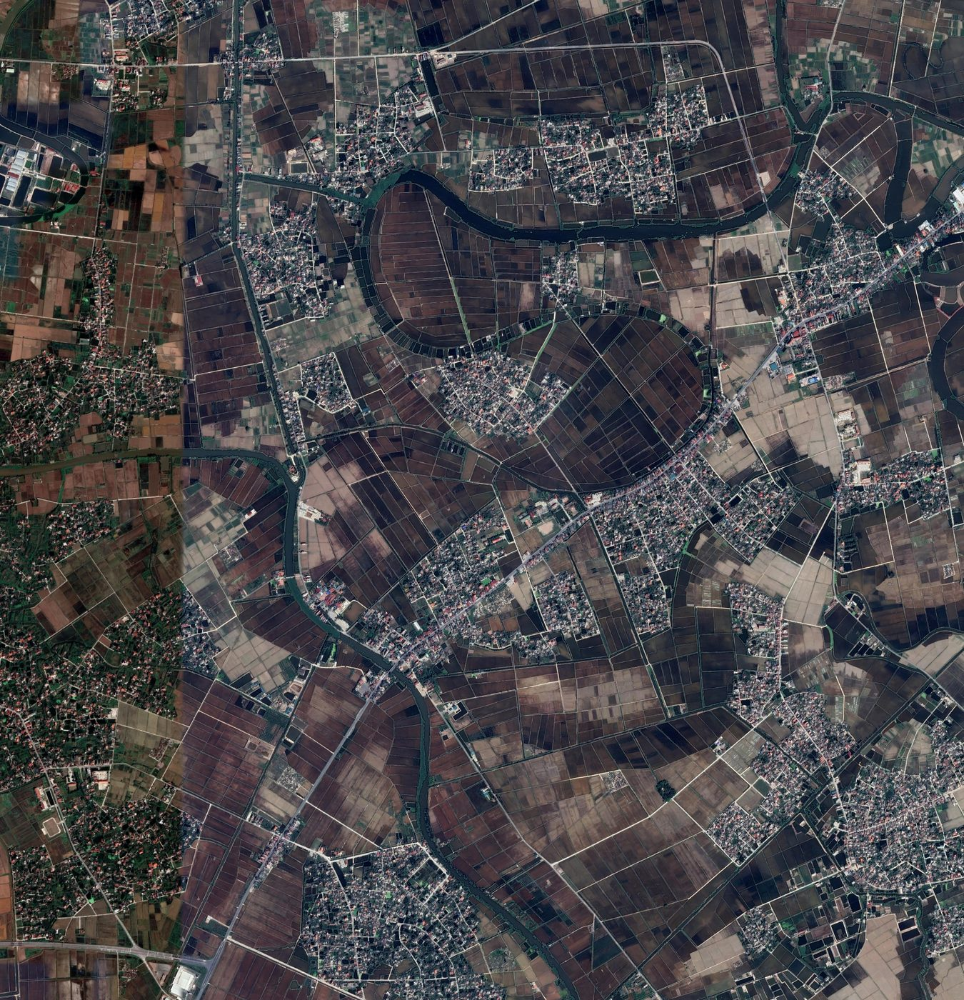
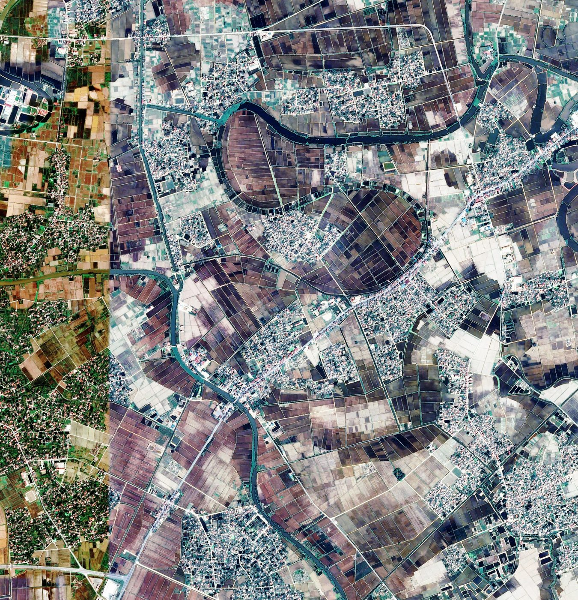
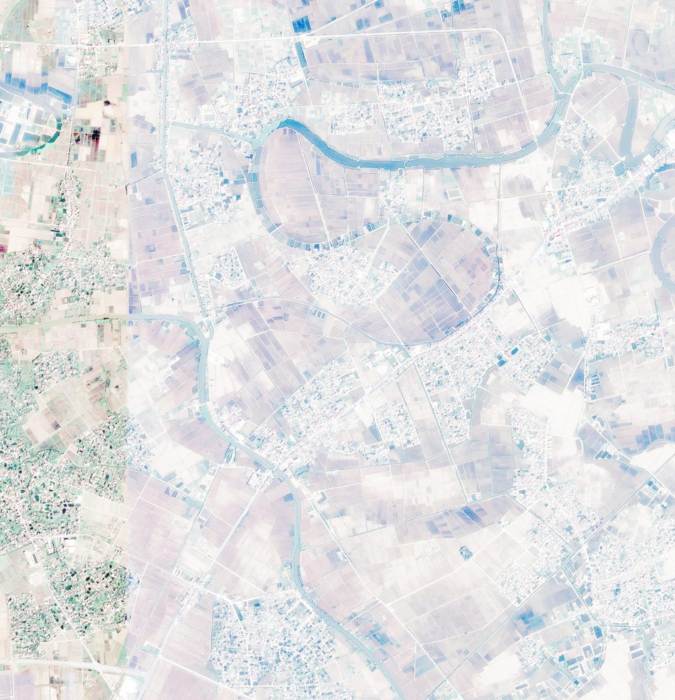
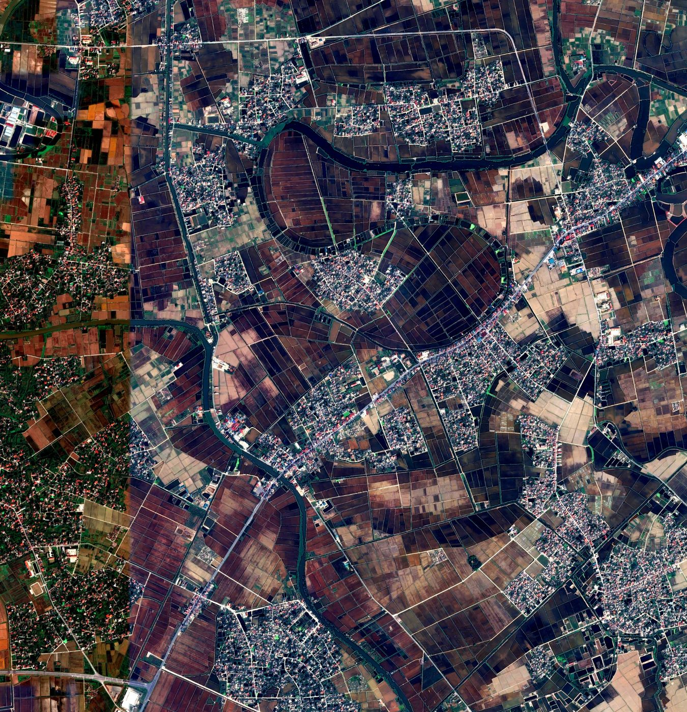

<div align="right">

  English | <a href="./README.zh-CN.md">简体中文</a>

</div>

# 🛰️ tif2jpg_pipeline: GeoTIFF Cropping + JPG Conversion + Optional Enhancement ✨

> Goal: batch-process **1-band / 3-band** GeoTIFF files (`.tif/.tiff`) into JPG images that are ready for **training or visualization**, with support for **patch cropping** and multiple optional enhancement strategies: AutoLevel, Equalize, MSR, and PIL.

---

## ✅ Features

- ✂️ **Crop**  
  Supports 1-band and 3-band TIFF files. Generates patches based on `crop_size` and `stride`, and writes them to **folder1**.  
  - Outputs **TIFF patches** by default, preserving georeferencing metadata
  - Optionally outputs **JPG patches**, which are more convenient for training datasets

- 🖼️ **TIFF → JPG Conversion**  
  Batch-converts TIFF files to JPG and writes the results to **folder2**.  
  - `raw/`: only bit-depth mapping and percentile stretching are applied; recommended baseline output
  - `enhanced_xxx/`: enhancement output generated from the raw result, based on the selected hyperparameters

- 🎛️ **Optional Enhancement Strategies**  
  Enhancement methods can be switched through command-line arguments:
  - `none` / `autolevel` / `equalize` / `msr` / `pil`

---

## 🧠 Should enhancement be applied on TIFF or JPG?

Remote-sensing TIFF data is often stored as **16-bit / float**, while JPG is **8-bit**.  
For more stable results, this project uses a staged processing strategy:

1. ✅ **Apply dynamic range mapping on high-bit-depth TIFF data first**, such as percentile stretching or an AutoLevel-style operation  
2. ✅ **Quantize the result to 8-bit**, producing the raw JPG  
3. ✅ **Apply OpenCV/PIL-style enhancement on the raw 8-bit JPG**, such as equalization, MSR, or PIL contrast/color enhancement

This is the default behavior of the project:

- `--pre_uint8_stretch 1` is enabled by default. It performs percentile stretching before 8-bit quantization.
- `equalize`, `msr`, and `pil` are applied on the **raw 8-bit** image, making the enhancement stable and controllable.

---

## 🖼️ Visual Examples

> Note: the original images are large. The examples below are compressed comparison images for easier viewing on GitHub.

### 1) Original image: raw / baseline


### 2) AutoLevel: percentile / contrast stretching


### 3) Equalize: white balance + per-channel equalization


### 4) MSR: Multi-Scale Retinex


### 5) PIL: contrast + color enhancement


---

## 📦 Default Output Structure

By default, output directories are created next to `input_dir`, meaning under the parent directory of `input_dir`:

- `crop_out_dir/`: cropped patch output; TIFF patches by default
- `crop_as_jpg/`: JPG patch output when `--crop_as_jpg 1` is enabled
- `jpg_out_dir/`
  - `raw/xxx.jpg`
  - `enhanced_<method>/xxx_<method>.jpg`

---

## 🏷️ Patch Naming Rule

Cropped patches follow this naming rule:

✅ **Original file name + `_` + index**

The index starts from `0` for each source TIFF.

For example, `ABC.tif` becomes:

- `ABC_0.tif, ABC_1.tif, ...`
- `ABC_0.jpg, ABC_1.jpg, ...` when `--crop_as_jpg 1` is enabled

---

## 🚀 Quick Start

### 1) Install dependencies

- Python 3.8+
- GDAL; `from osgeo import gdal` must work
- numpy
- opencv-python
- pillow; required only when using `--enhance pil`
- tqdm; optional

### 2) Run with default output paths

```bash
python tif2jpg_pipeline_v3.py --input_dir "D:\data\tif" --do_crop 1 --do_convert 1
```

---

## ✂️ Crop Usage

### Output TIFF patches with georeferencing preserved

```bash
python tif2jpg_pipeline_v3.py ^
  --input_dir "D:\data\tif" ^
  --do_crop 1 --do_convert 0 ^
  --crop_size 256 --stride 256 ^
  --skip_zero 1
```

### Output JPG patches for training

```bash
python tif2jpg_pipeline_v3.py ^
  --input_dir "D:\data\tif" ^
  --do_crop 1 --do_convert 0 ^
  --crop_as_jpg 1 ^
  --crop_size 256 --stride 256
```

---

## 🖼️ Convert + Enhance Usage

### Raw + MSR

```bash
python tif2jpg_pipeline_v3.py ^
  --input_dir "D:\data\tif" ^
  --do_crop 0 --do_convert 1 ^
  --enhance msr --msr_scales 15,101,301 ^
  --jpg_quality 95
```

### Raw + Equalize with optional white balance

```bash
python tif2jpg_pipeline_v3.py ^
  --input_dir "D:\data\tif" ^
  --do_crop 0 --do_convert 1 ^
  --enhance equalize --do_white_balance 1
```

### Raw + PIL contrast/color enhancement

```bash
python tif2jpg_pipeline_v3.py ^
  --input_dir "D:\data\tif" ^
  --do_crop 0 --do_convert 1 ^
  --enhance pil --pil_contrast 1.5 --pil_color 1.5
```

---

## 🎚️ Common Parameters

- `--crop_size`: patch size; default: `256`
- `--stride`: sliding-window stride; default: `256`
- `--skip_zero`: skip patches containing zero-valued pixels; default: `1`
- `--band_order`: channel order for reading 3-band images; default: `1,2,3`
- `--stretch_low / --stretch_high`: percentile stretching range; default: `0.001~0.999`
  - For stronger stretching, try `0.01~0.99`
- `--enhance`: enhancement method; options: `none/autolevel/equalize/msr/pil`
- `--pre_uint8_stretch`: percentile stretching before 8-bit quantization; default: `1`, recommended

---

## 🧩 Tips for More Stable Remote-Sensing Results

- 🌈 **Wrong colors**: check `--band_order` first. Many remote-sensing images do not use standard RGB ordering.
- 💡 **Too dark or too bright**: adjust `--stretch_low` and `--stretch_high`.
  - Example: `--stretch_low 0.01 --stretch_high 0.99`
- 🧼 **More natural contrast**: `autolevel` is usually more stable.
- 🧠 **Stronger texture visibility**: `msr` is often more powerful, but the result may look harder or less natural.

---

## 📄 License

Use the license of your repository. MIT or Apache-2.0 is recommended if you do not already have one.
